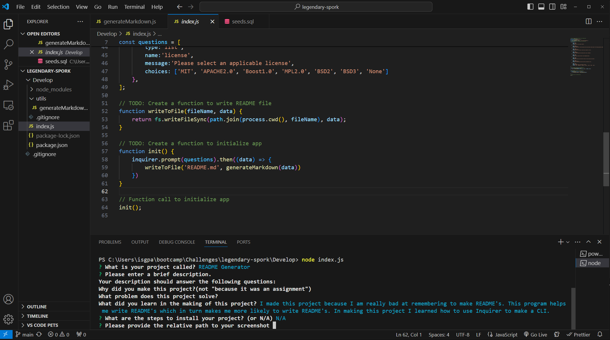

# README Generator

## Table of Contents

-[Description](#description)

-[Installation](#installation)

-[Screenshot](#screenshot)

-[Usage](#usage)

-[Contributions](#contributions)

## Description

I made this project because I am bad at remembering to write README's for my code. This README generator solves this issue by making README generation easier which makes me more likely to remember to write the README, In creating this project I learned Alot about how Inquirer works and how to make a CLI

## Installation

Navigate to the develop folder and open the command line. Then simply type 'npm i' and await installation completion.

## Screenshot

### deployed page --> N/A

## Usage

If the npm i installation is complete all that is left to do is type 'node index.js' into the command line and if god loves you, you will be greeted with the README generator prompts.

Walkthrough Video - https://drive.google.com/file/d/1uf2e5tHIXnUYIcq6sbdpwI_LscSus3aN/view

## License

MIT License

https://opensource.org/licenses/MIT

## Contributions

N/A
